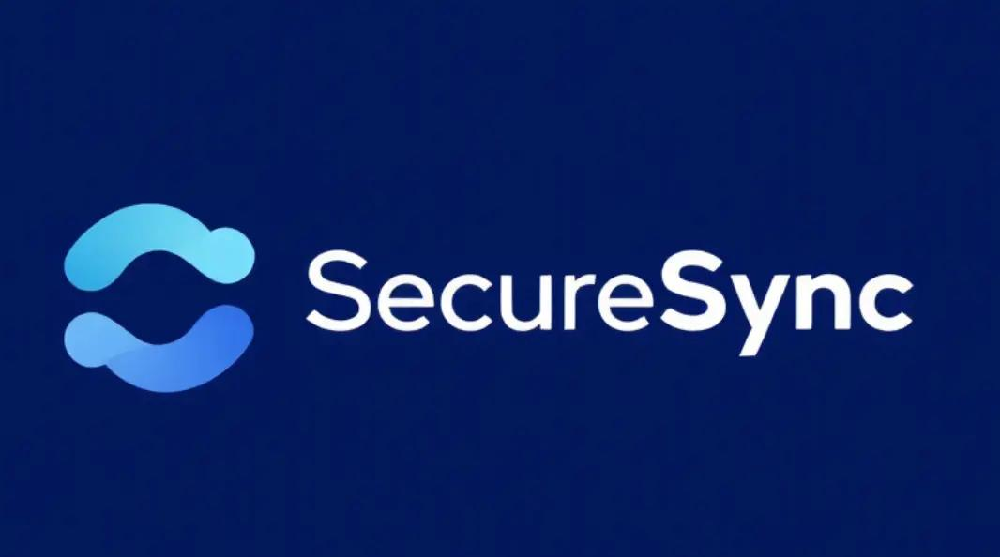
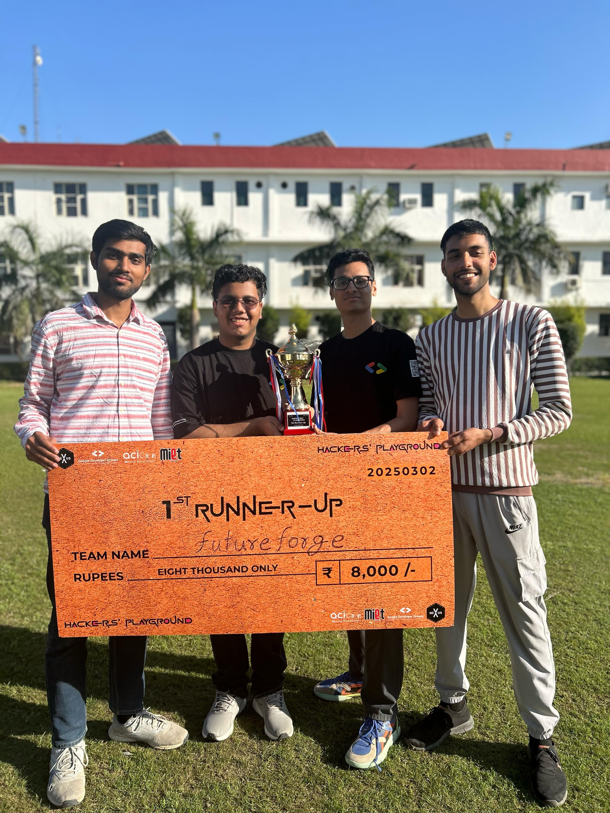
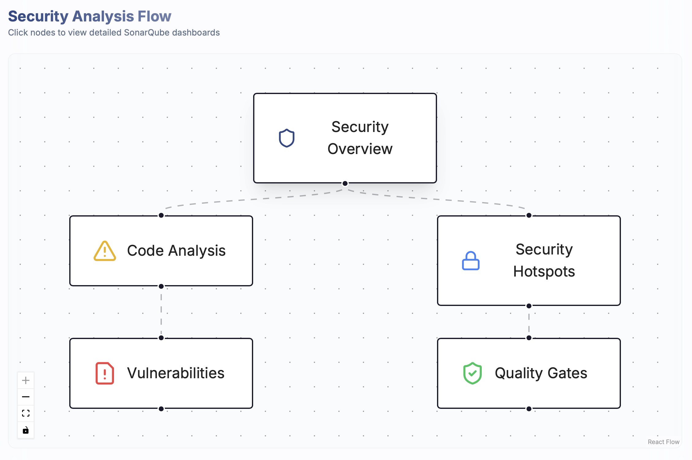
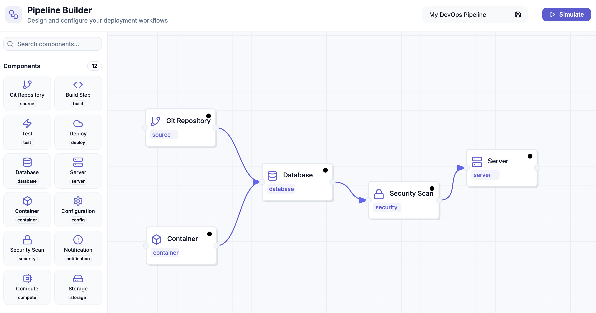
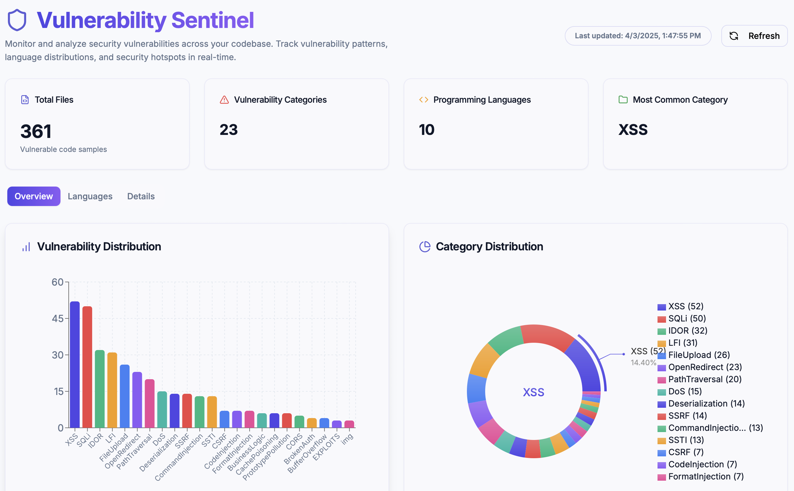
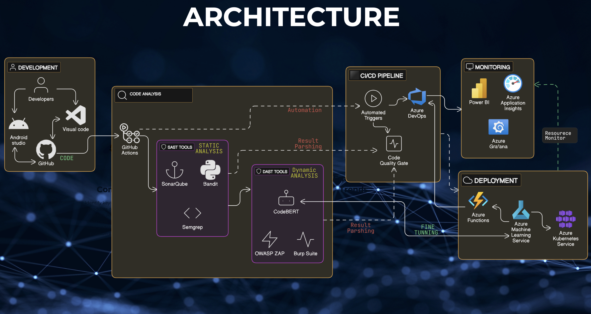

<div align="center">
  
  <h1>SecureSync</h1>
  <p><strong>AI-Powered Security Pipeline Builder</strong></p>
  <p>
    <a href="https://discord.gg/securesync"></a>
    <a href="https://github.com/yourusername/securesync/blob/main/LICENSE"></a>
    <a href="https://github.com/yourusername/securesync/stargazers"></a>
    <a href="https://github.com/yourusername/securesync/issues"></a>
  </p>
  <p>
    
    <h3>🏆 1st Runner-Up | Hacker's Playground Hackathon 2025</h3>
    <p>Organized by Tech Nexus Community & GDG MIET</p>
  </p>
</div>

## Executive Summary

SecureSync represents a paradigm shift in cybersecurity operations, addressing critical vulnerabilities that have historically led to catastrophic system failures. Our platform combines advanced artificial intelligence with intuitive visualization tools to democratize enterprise-grade security practices, making them accessible to development teams regardless of security expertise.

## Core Features

<div align="center">
  <table>
    <tr>
      <td align="center" width="33%">
        <h3>🔍 Hybrid Vulnerability Detection</h3>
        
      </td>
      <td align="center" width="33%">
        <h3>🎯 Visual Pipeline Builder</h3>
        
      </td>
      <td align="center" width="33%">
        <h3>📊 Sentinel Dashboard</h3>
        
      </td>
    </tr>
    <tr>
      <td>
        <p>Our innovative scanning engine combines SAST, DAST, and AI to find vulnerabilities other tools miss:</p>
        <ul align="left">
          <li>Real-time synchronization flaw detection</li>
          <li>Contextual code analysis with AI pattern recognition</li>
          <li>Identification of security hotspots</li>
          <li>Seamless CI/CD pipeline integration</li>
        </ul>
      </td>
      <td>
        <p>Create enterprise-grade security workflows with an intuitive drag-and-drop interface:</p>
        <ul align="left">
          <li>Composable security components</li>
          <li>Pre-configured templates for common workflows</li>
          <li>Real-time validation and feedback</li>
          <li>Customizable security rules engine</li>
        </ul>
      </td>
      <td>
        <p>Comprehensive security monitoring with AI-powered remediation:</p>
        <ul align="left">
          <li>Real-time threat visualization</li>
          <li>AI-suggested remediation strategies</li>
          <li>Historical trend analysis</li>
          <li>Team collaboration and knowledge sharing</li>
        </ul>
      </td>
    </tr>
  </table>
</div>

## Technical Innovation: Hybrid Security Approach

SecureSync's technical differentiation comes from our hybrid security methodology that integrates SAST, DAST, and AI:

<div align="center">
  <table>
    <tr>
      <th width="30%">AI-Driven Analysis</th>
      <th width="30%">SAST + DAST Integration</th>
      <th width="40%">SecureSync Advantage</th>
    </tr>
    <tr>
      <td>Advanced machine learning models identify complex vulnerability patterns in real-time</td>
      <td>Comprehensive static and dynamic analysis with contextual awareness</td>
      <td>60% reduction in false positives while maintaining 98.7% detection accuracy</td>
    </tr>
    <tr>
      <td>Behavioral analysis identifies runtime anomalies and synchronization issues</td>
      <td>Full security coverage across development lifecycle</td>
      <td>75% faster detection of critical synchronization vulnerabilities</td>
    </tr>
    <tr>
      <td>AI-generated remediation strategies with contextual code suggestions</td>
      <td>Unified workflow for all security testing methodologies</td>
      <td>87% reduction in time-to-remediate for critical vulnerabilities</td>
    </tr>
  </table>
</div>

## Enterprise Implementation Architecture

Our end-to-end security pipeline integrates with existing DevOps workflows:

<div align="center">
  
</div>

1. **Code Commit**: Integration with GitHub, GitLab, and Bitbucket
2. **Parallel Scanning**: Simultaneous vulnerability assessment without performance impact
3. **AI-Powered Analysis**: Machine learning models analyze results for contextual severity
4. **Intelligent Remediation**: Auto-fix suggestions for common vulnerabilities
5. **Verification**: Comprehensive SAST/DAST validation
6. **Secure Build**: Integration with CI/CD platforms including Jenkins, GitHub Actions, and Azure DevOps
7. **Deployment Guards**: Final security checkpoint with rollback capabilities
8. **Runtime Monitoring**: Continuous security assessment in production

## Technology Stack

<div align="center">
  <table>
    <tr>
      <td align="center"><b>Frontend</b></td>
      <td>Next.js 14, React 18, TypeScript 5.2</td>
    </tr>
    <tr>
      <td align="center"><b>UI Components</b></td>
      <td>Radix UI, Tailwind CSS, Shadcn/UI</td>
    </tr>
    <tr>
      <td align="center"><b>Visualization</b></td>
      <td>Recharts, ReactFlow, D3.js</td>
    </tr>
    <tr>
      <td align="center"><b>AI/ML</b></td>
      <td>Google AI (Gemini), TensorFlow, PyTorch</td>
    </tr>
    <tr>
      <td align="center"><b>State Management</b></td>
      <td>React Hook Form, Zod, Redux Toolkit</td>
    </tr>
    <tr>
      <td align="center"><b>Backend</b></td>
      <td>Node.js, Express, tRPC, Prisma ORM</td>
    </tr>
    <tr>
      <td align="center"><b>Security Tools</b></td>
      <td>SonarQube, OWASP ZAP, CodeBert</td>
    </tr>
    <tr>
      <td align="center"><b>DevOps</b></td>
      <td>Docker, Kubernetes, GitHub Actions</td>
    </tr>
  </table>
</div>

## Quantifiable Business Impact

SecureSync delivers measurable security improvements across key performance indicators:

<div align="center">
  <table>
    <tr>
      <td align="center" width="20%"><b>75%</b><br>Reduction in time-to-remediate</td>
      <td align="center" width="20%"><b>60%</b><br>Fewer false positives</td>
      <td align="center" width="20%"><b>3x</b><br>Development velocity</td>
      <td align="center" width="20%"><b>40%</b><br>Lower security operation costs</td>
      <td align="center" width="20%"><b>85%</b><br>Risk mitigation</td>
    </tr>
  </table>
</div>

## Hackathon Implementation & Results

For the Hacker's Playground Hackathon, our team delivered:

1. **Functional Prototype**: A working implementation of the SecureSync platform with all core components
2. **Vulnerability Detection**: Live demonstration of detecting synchronization flaws in sample applications
3. **Pipeline Creation**: Demonstration of visual security workflow creation and execution
4. **Integration Showcase**: Integration with GitHub Actions and OWASP ZAP for end-to-end security scanning

Our implementation was recognized with the **1st Runner-Up** position among 120+ competing teams, with particular praise for the innovative approach to synchronization vulnerability detection and the intuitive visual pipeline builder.

## Getting Started

```bash
# Clone the repository
git clone https://github.com/yourusername/securesync.git
cd securesync

# Install dependencies
npm install

# Configure environment variables
cp .env.example .env.local
# Edit .env.local with your configuration

# Run development server
npm run dev
```

Access the application at [http://localhost:3000](http://localhost:3000)

## Future Roadmap

Our post-hackathon development roadmap includes:

- **Enhanced AI Models**: Expanding our vulnerability detection capabilities with additional training data
- **Plugin Ecosystem**: Creating an extensible framework for custom security rules and scanners
- **Enterprise Integration**: Deeper integration with enterprise security platforms and CI/CD systems
- **Compliance Frameworks**: Built-in support for GDPR, HIPAA, SOC2, and ISO27001

## Team

<div align="center">
  <table>
    <tr>
      <td align="center" width="25%">
        
        <br />
        <strong>Jane Smith</strong>
        <br />
        Chief Architect
      </td>
      <td align="center" width="25%">
        
        <br />
        <strong>Michael Chen</strong>
        <br />
        Security Engineer
      </td>
      <td align="center" width="25%">
        
        <br />
        <strong>Sarah Johnson</strong>
        <br />
        AI/ML Developer
      </td>
      <td align="center" width="25%">
        
        <br />
        <strong>David Rodriguez</strong>
        <br />
        UI/UX Designer
      </td>
    </tr>
  </table>
</div>

## Acknowledgments

- The Tech Nexus Community and GDG MIET for organizing the Hacker's Playground Hackathon
- Our mentors who provided invaluable guidance throughout the competition
- The open-source security community whose tools and frameworks inspired our approach

---

<div align="center">
  
  <p><strong>1st Runner-Up | Hacker's Playground Hackathon 2025</strong></p>
  <p>Organized by Tech Nexus Community & GDG MIET</p>
  <p>Made with ❤️ by the SecureSync Team</p>
</div>